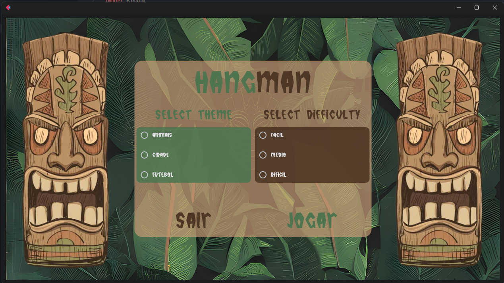
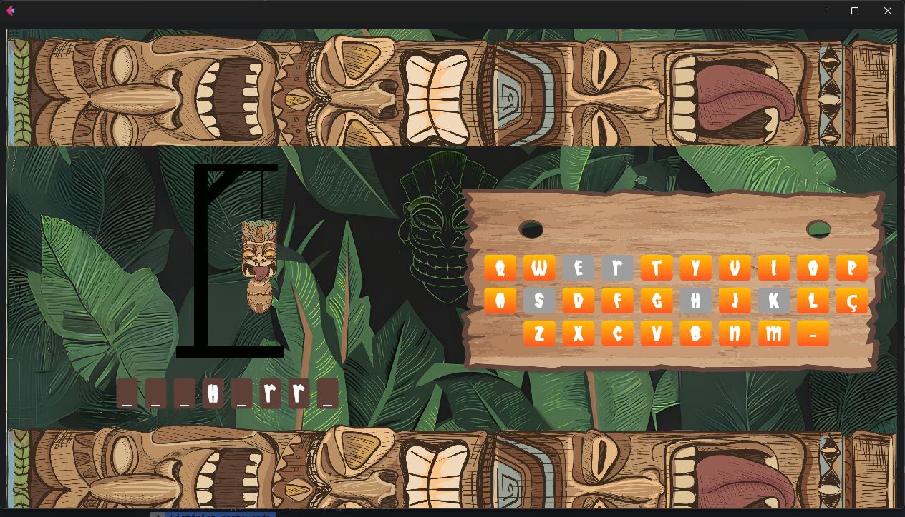

# Jogo da Forca 🎮

Este é um jogo da forca simples desenvolvido em Python usando a biblioteca [Flet](https://github.com/ffont/flet) para criar a interface do usuário.

## Como Jogar 🕹️

- **Execute o arquivo `main.py`** para iniciar o jogo.
- Uma palavra será escolhida aleatoriamente.
- **Clique nas letras do teclado virtual** para adivinhar a palavra.
- Tente adivinhar a palavra antes que o enforcado seja completado!
- Você pode optar por **iniciar um novo jogo ou sair** quando terminar.

## Requisitos ⚙️

- Python 3.6 ou superior instalado no seu sistema.
- Biblioteca Flet, que pode ser instalada usando o comando:

## Estrutura do Projeto 📁

A estrutura do projeto é a seguinte:

- **`main.py`**: Contém o código principal do jogo.
- **`assets/`**: Pasta que contém os recursos utilizados no jogo.
  - **`images/`**: Pasta que contém as imagens do jogo, como as diferentes fases do enforcado.
  - **`keyboard.png`**: Imagem do teclado virtual.
- **`README.md`**: Este arquivo que você está lendo.

## Contribuição 🤝

Se você quiser contribuir para o projeto, sinta-se à vontade para abrir um pull request. Toda contribuição é bem-vinda!

## Licença 📝

Este projeto está licenciado sob a [Licença MIT](https://opensource.org/licenses/MIT).
