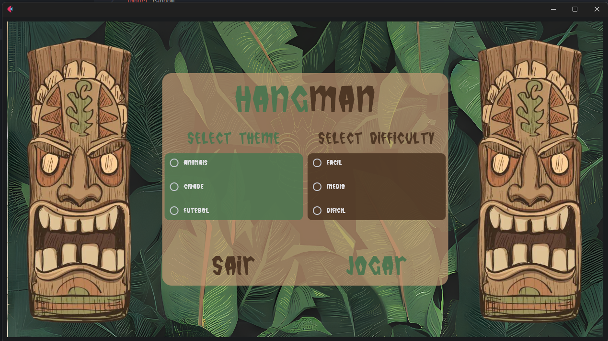

# Jogo da Forca 🎮

🔗 **Jogue online:** https://luis-lhgdf.github.io/jogo-da-forca/




Este é um jogo da forca simples desenvolvido em Python usando a biblioteca [Flet](https://flet.dev) para criar a interface do usuário. A versão web roda inteiramente no navegador (Pyodide) e é publicada automaticamente no GitHub Pages.

## Como Jogar 🕹️

- Escolha um **tema** (Animais, Cidade ou Futebol) e uma **dificuldade** (Fácil, Médio ou Difícil).
- Clique em **JOGAR**. Uma palavra do tema será sorteada.
- **Clique nas letras do teclado virtual** para adivinhar a palavra.
- Tente adivinhar a palavra antes que o enforcado seja completado (7 erros)!
- Ao final, clique em **NOVO JOGO** para voltar ao menu.

## Rodando localmente ⚙️

Requisitos: Python 3.9 a 3.12.

```bash
pip install -r requirements.txt
python main.py          # abre como aplicativo desktop
# ou
flet run --web main.py  # abre no navegador
```

## Deploy no GitHub Pages 🚀

O workflow [`.github/workflows/deploy-pages.yml`](.github/workflows/deploy-pages.yml) roda a cada push na branch `main`:

1. Instala o Flet (versão fixada em `requirements.txt`).
2. Monta uma pasta `build/` só com `main.py` e `assets/`.
3. Executa `flet publish` com `--base-url /jogo-da-forca/` (o site não fica na raiz do domínio) e `--route-url-strategy hash`.
4. Publica a pasta `dist/` no GitHub Pages.

Nas configurações do repositório, em **Settings → Pages**, a fonte precisa estar como **GitHub Actions**.

Para testar o build web localmente:

```bash
mkdir -p build && cp main.py build/ && cp -r assets build/assets
echo "flet-pyodide==0.22.1" > build/requirements.txt
flet publish build/main.py --assets assets --distpath dist --base-url /jogo-da-forca/ --route-url-strategy hash
```

## Estrutura do Projeto 📁

- **`main.py`**: código principal do jogo.
- **`assets/`**: recursos usados no jogo.
  - **`images/`**: fundo, cenário, teclado e as fases do enforcado (`hangman_0.png` a `hangman_7.png`).
  - **`fonts/`**: fonte TROPICAN usada na interface.
- **`requirements.txt`**: dependências Python.
- **`.github/workflows/deploy-pages.yml`**: deploy automático no GitHub Pages.

## Contribuição 🤝

Se você quiser contribuir para o projeto, sinta-se à vontade para abrir um pull request. Toda contribuição é bem-vinda!

## Licença 📝

Este projeto está licenciado sob a [Licença MIT](https://opensource.org/licenses/MIT).
