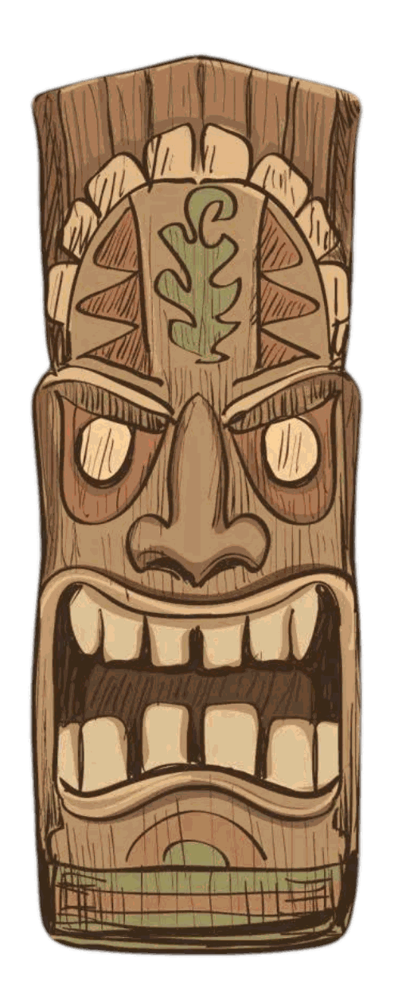
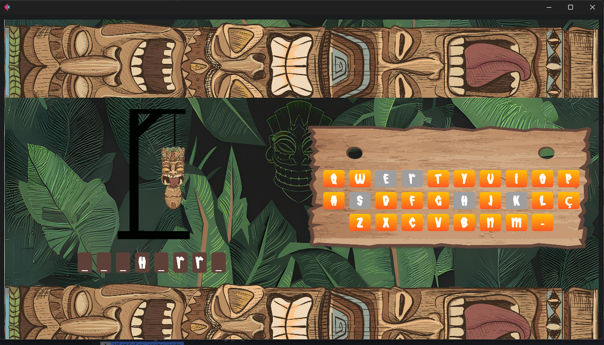

<div align="center">



# Jogo da Forca

**O clássico jogo da forca em Python com Flet: três temas, três dificuldades e teclado virtual. Roda no desktop e no navegador.**

<a href="https://luis-lhgdf.github.io/jogo-da-forca/"></a>

[](https://luis-lhgdf.github.io/jogo-da-forca/)


</div>

---

## Jogar online

**https://luis-lhgdf.github.io/jogo-da-forca/**

A versão web roda inteiramente no navegador, via Pyodide — não há servidor. Cada push na `main` publica de novo no GitHub Pages.

## Como jogar

1. Escolha um **tema** (Animais, Cidade ou Futebol) e uma **dificuldade** (Fácil, Médio ou Difícil).
2. Clique em **JOGAR**. Uma palavra do tema é sorteada.
3. Clique nas letras do teclado virtual para adivinhar.
4. Sete erros completam o enforcado e encerram a partida.
5. Ao final, **NOVO JOGO** volta ao menu.

<div align="center">

</div>

## Rodando localmente

Requisitos: Python 3.9 a 3.12.

```bash
git clone https://github.com/Luis-lhgdf/jogo-da-forca.git
cd jogo-da-forca
pip install -r requirements.txt

python main.py           # abre como aplicativo desktop
flet run --web main.py   # abre no navegador
```

## Deploy no GitHub Pages

O workflow [`deploy-pages.yml`](.github/workflows/deploy-pages.yml) roda a cada push na `main`:

1. Instala o Flet na versão fixada em `requirements.txt`.
2. Monta uma pasta `build/` só com `main.py` e `assets/`.
3. Executa `flet publish` com `--base-url /jogo-da-forca/` (o site não fica na raiz do domínio) e `--route-url-strategy hash`.
4. Publica a pasta `dist/` no GitHub Pages.

Em **Settings › Pages** do repositório, a fonte precisa estar como **GitHub Actions**.

Para testar o build web localmente:

```bash
mkdir -p build && cp main.py build/ && cp -r assets build/assets
echo "flet-pyodide==0.22.1" > build/requirements.txt
flet publish build/main.py --assets assets --distpath dist --base-url /jogo-da-forca/ --route-url-strategy hash
```

## Estrutura

```
main.py                  lógica do jogo e interface Flet
assets/
  images/                fundo, cenário, teclado e as fases do enforcado (hangman_0 a hangman_7)
  fonts/                 fonte TROPICAN usada na interface
requirements.txt         dependências Python
.github/workflows/       deploy automático no GitHub Pages
docs/                    prints usados neste README
```

## Contribuição

Sugestões e pull requests são bem-vindos.

---

## English

Hangman game written in Python with [Flet](https://flet.dev): three themes (animals, cities, football), three difficulty levels and an on-screen keyboard. Runs as a desktop app or in the browser via Pyodide — the web build is published to GitHub Pages on every push to `main`. **Interface is in Portuguese.**

Play it online: https://luis-lhgdf.github.io/jogo-da-forca/

```bash
pip install -r requirements.txt
python main.py
```

---

## Licença

MIT — veja [LICENSE](LICENSE).
